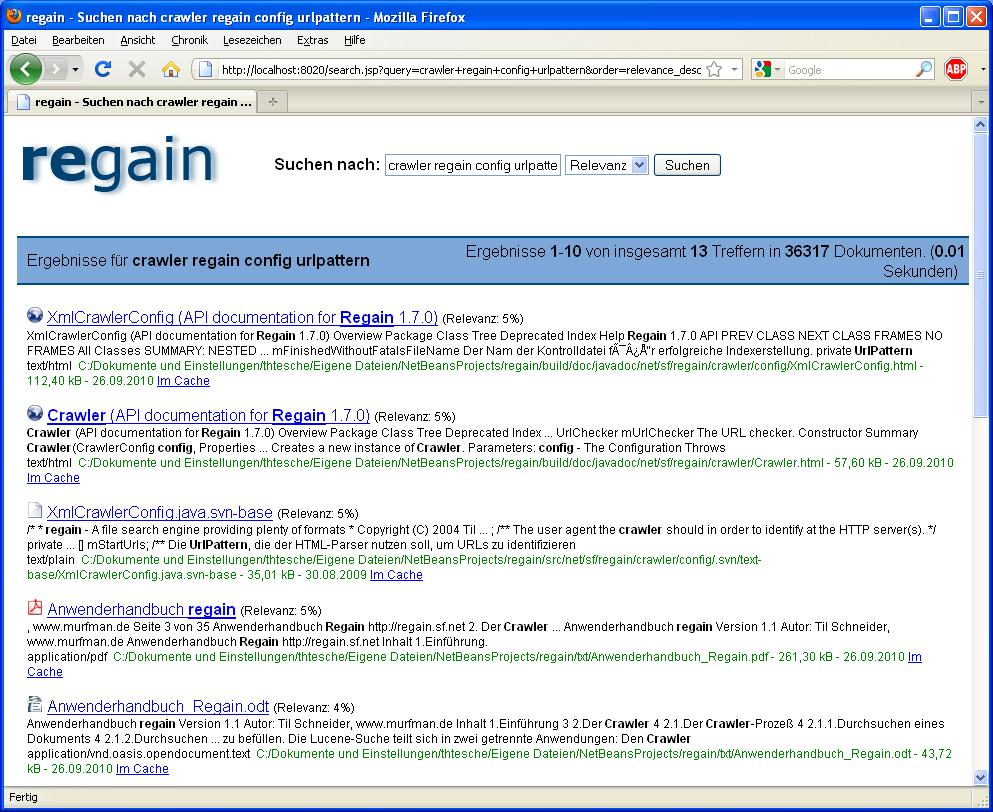

[Deutsche Übersetzung](README_de.md)

regain your hidden information
==================================================================

regain is a search engine running on desktop or server with support for various file formats.

What is regain?
---------------

regain is a search engine similar to web search engines like Google, with the difference that you don't search the web, but your own files and documents. Using regain you can search through large portions of data (several gigabytes!) in split seconds!

This is possible by using a search index. regain crawles through your files or webpages, extracts all text and puts it in a smart search index. All this happens in the background. So if you want to search something you get the results immediately.

There are two versions of regain: The desktop search and the server search. The desktop search is to be used on a normal desktop computer and it offers you a fast search for documents or intranet webpages. The server search you can install on web servers. It provides searching functionality for a website or for intranet fileservers.

regain is written in Java and thus applicable on all Java compatible platforms (amongst others Windows, Linux, Mac OS, Solaris). The server search works with Java Server Pages (JSPs) and a tag library, the desktop search comes with its own small webserver.

regain is released under the open source license [LGPL](LICENSE.md) (Lesser General Public License). I.e. regain may be used for free without any temporal limit.

Features
--------

regain offers lots of very useful functions that are important for an effective search engine.

You can find detailed information about specific features in the [regain help](http://regain.murfman.de/features).

Download
--------

There are two variants of regain: The server search and the desktop search. The desktop search is meant for those, who want to use regain on their workstation or who want to give regain a try. The server search is meant for administrators of a web sercer, who want to integrate a search in their web site or intranet site.

More details about the differences of the two variants can be found in the [comparison of the regain variants](http://regain.murfman.de/en:project_info:variant_comparison).

If you are not sure, which download is the best for you, then take the first one (Desktop Search for Windows).

Download [Regain Desktop Search 2.1.0 Stable for Windows (Installer)](http://sourceforge.net/projects/regain/files/regain/2.1.0%20Stable/regain_v2.1.0-STABLE_desktop_win.exe/download)

Download [Regain Desktop Search 2.1.0 Stable for Windows (ZIP file)](http://sourceforge.net/projects/regain/files/regain/2.1.0%20Stable/regain_v2.1.0-STABLE_desktop_win.zip/download)

Download [Regain Desktop Search 2.1.0 Stable for Linux (ZIP file)](http://sourceforge.net/projects/regain/files/regain/2.1.0%20Stable/regain_v2.1.0-STABLE_desktop_linux.zip/download)

Download [Regain Server Search 2.1.0 Stable for all platforms (ZIP file)](http://sourceforge.net/projects/regain/files/regain/2.1.0%20Stable/regain_v2.1.0-STABLE_server.zip/download)

Documentation
-------------

### regain Help

The regain help contains information about the installation, configuration and usage of regain.

[**To the regain help**](http://regain.murfman.de/start)

### Javadoc and taglib documentation

The documentation of the Java classes and the tag library. It's interesting for those who want to develop regain.

Download [Javadoc documentation for regain 2.1.0 Stable](http://sourceforge.net/projects/regain/files/regain/2.1.0%20Stable/regain_v2.1.0-STABLE_doc.zip/download)

You may also read the documentation online: [Javadoc documentation for regain 2.1.0 Stable](http://regain.sourceforge.net/doc/v2.1.0-STABLE/javadoc/index.html) resp. [Tag library documentation for regain 2.1.0 Stable](http://regain.sourceforge.net/doc/v2.1.0-STABLE/tlddoc/index.html).

### User's manual for regain 1.1

Until the version 1.1 regain had a user's manual. Since now not everything has been moved from the old manual to the new regain help.

You can download the old manual here: [Download Anwenderhandbuch_Regain.pdf (in German language)](http://regain.sourceforge.net/download/Anwenderhandbuch_Regain.pdf)

### Seminar thesis about Lucene

During my studies at the FH Karlsruhe I wrote a seminar thesis about lucene. The thesis mentions regain only marginally, but it shows internal details of [Jakarta Lucene](http://jakarta.apache.org/lucene) which is the base of regain.

The thesis is interesting for those who want to learn more about the background of a search engine.

Download: [Seminararbeit_Lucene_Ausarbeitung.pdf (in German language)](http://regain.sourceforge.net/download/Seminararbeit_Lucene_Ausarbeitung.pdf)

Download: [Seminararbeit_Lucene_Vortrag.pdf (in German language)](http://regain.sourceforge.net/download/Seminararbeit_Lucene_Vortrag.pdf)
